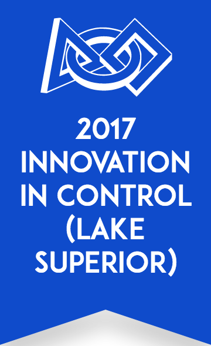

<html>
<head>

</head>

<body>
 <h1>2017-Robot-Code</h1>

 

2017 Robot Code using Python

Drivetrain = Octocanum

Priorities = Gear, Climb, Drop Fuel in Low Goal

Autonomous = Place Gear, drop ten fuel off at low goal

Authored by the great Josh and Caleb programming team

<h3><i>Powered By The Following</i></h3>:

 -Python 3 and RobotPy

 -Bugs

 -Unintended Features (see item 2, Bugs.) 

 -Print Statement Debugging (using words such as the ever popular, "Hi" , "Yo", and "I'm here bro")  
 </body>
</html>
